*Read this in other languages: [English](README.md), [Português](README.pt.md), [Русский](README.ru.md).*

Author: Diego Cavalcante\
E-Mail: diego@suportecavalcante.com.br\
Telegram: [diego_cavalcante](https://t.me/diego_cavalcante)\
Description: pack of almost 3000 icons for Zabbix Maps

Some images were taken from Google and others created from scratch in different colors and sizes. If you, like me, have spent some time developing maps, screens, and slideshows, congratulations because I know how slow and often complicated to express our environment and infrastructure in a visual and uncomplicated way, I hope you enjoy it.

NOTE: some images are free to use, others are proprietary.

# ICONES

Note: file and directory names are translated into English, names are corrected to reduce confusion after importing to Zabbix.

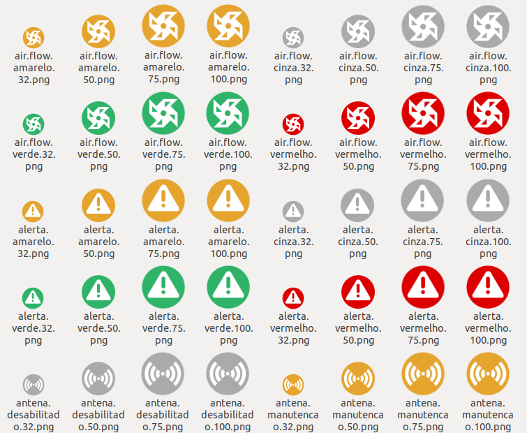

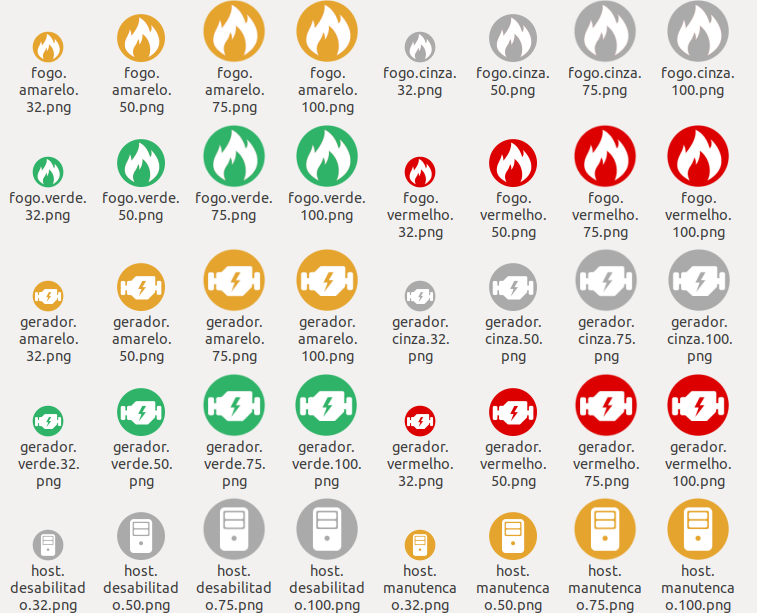
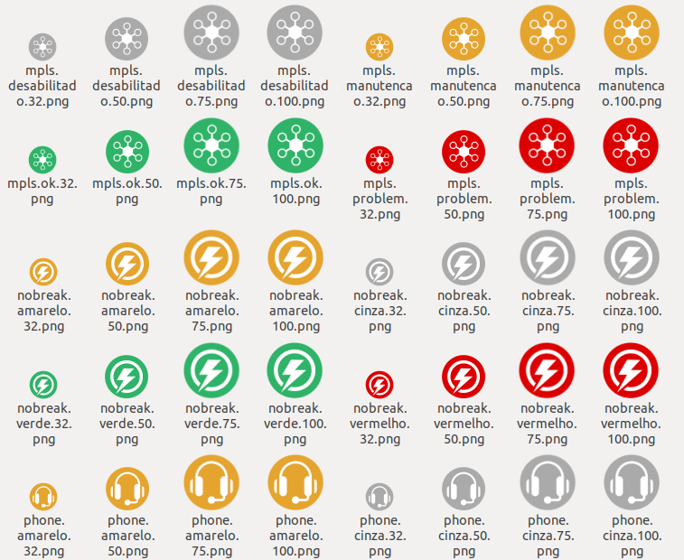
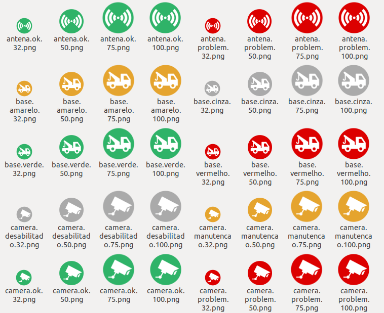
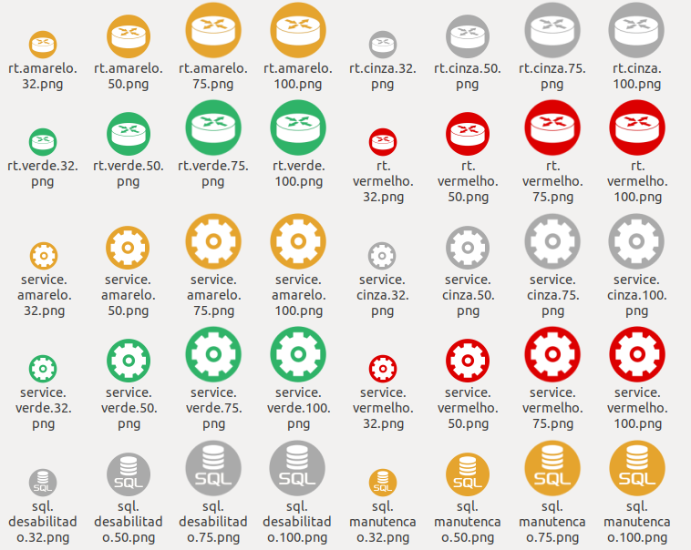

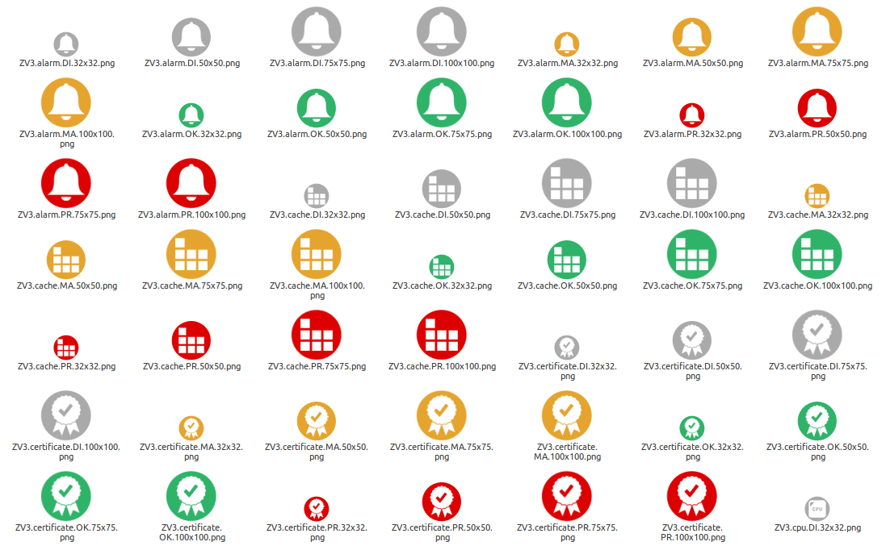
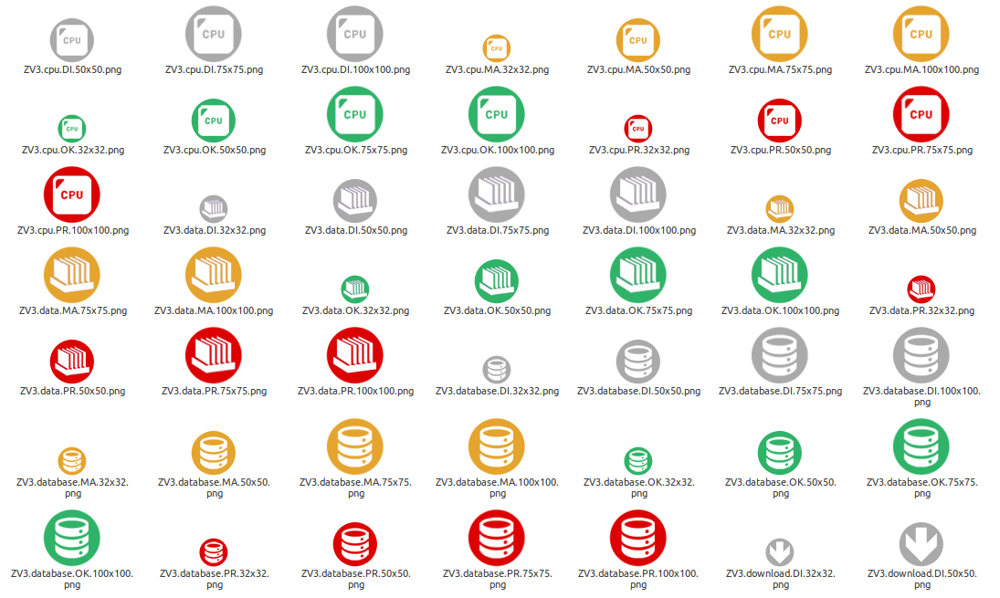
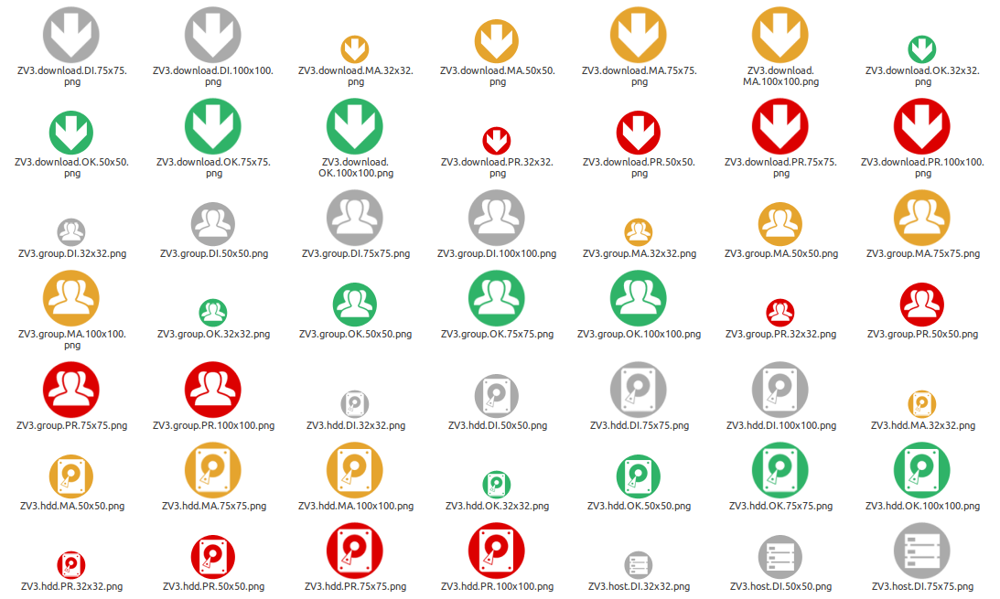
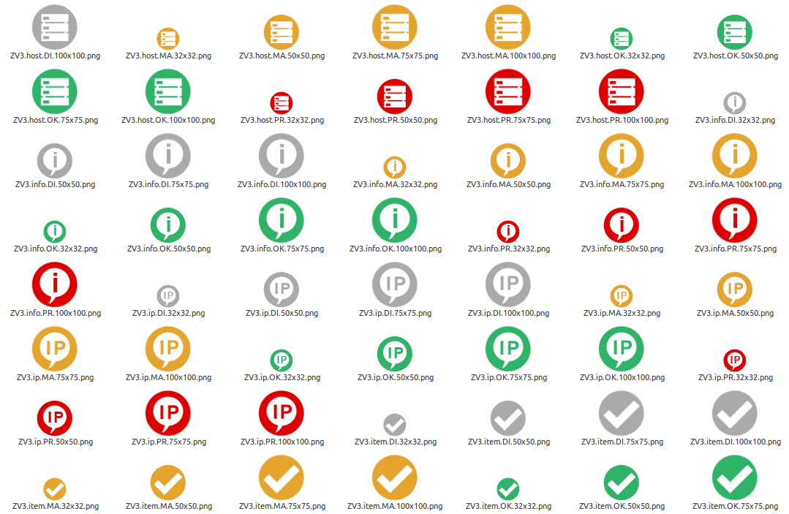
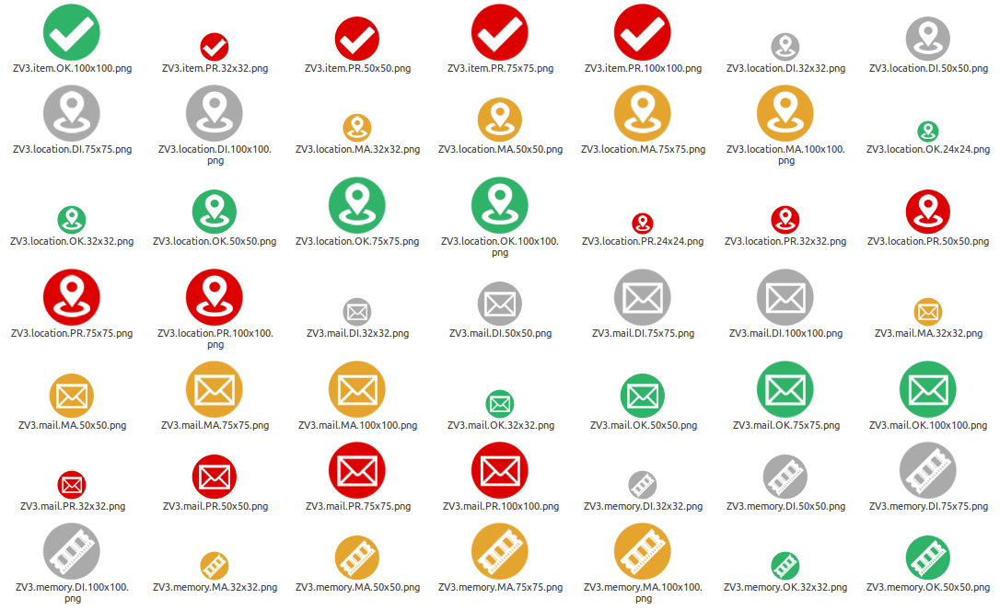

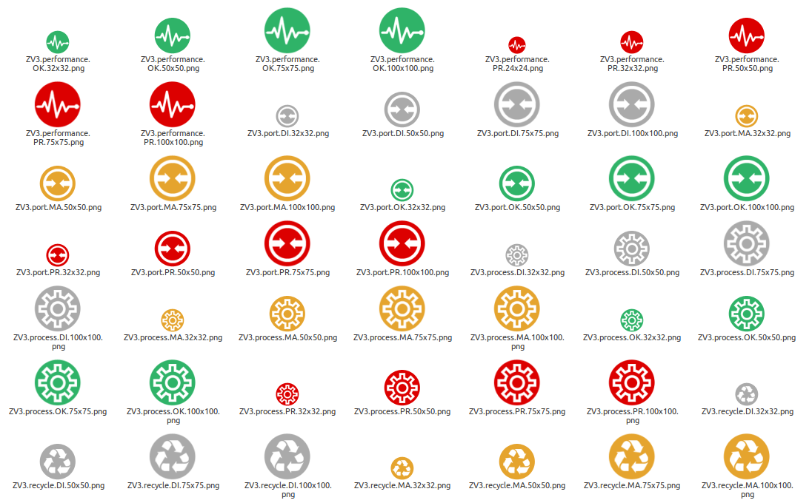

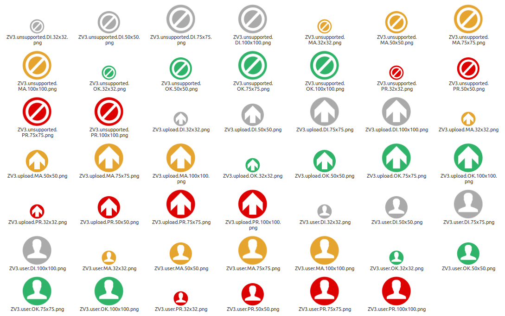
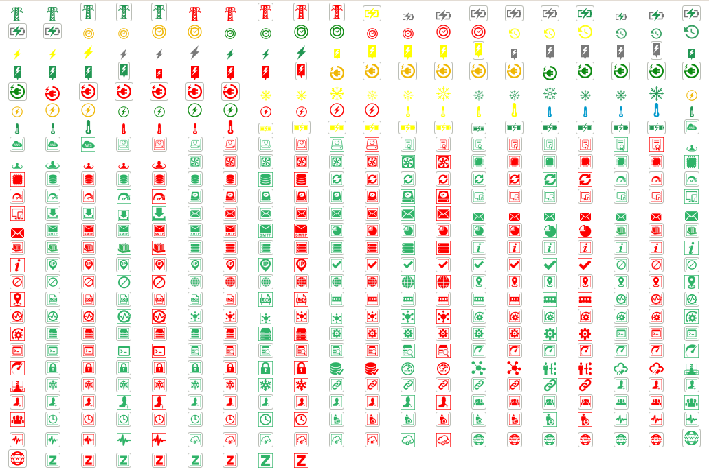
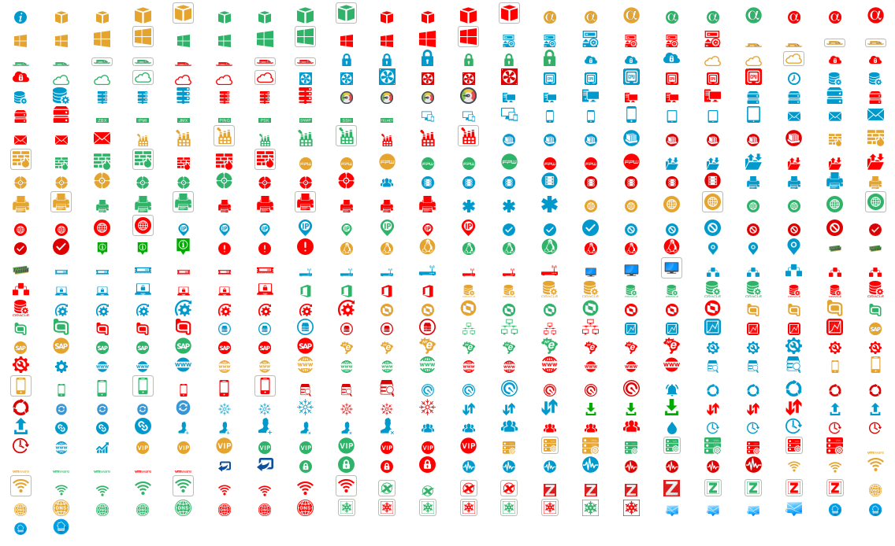
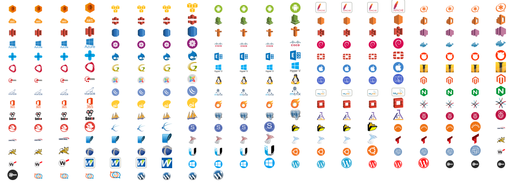
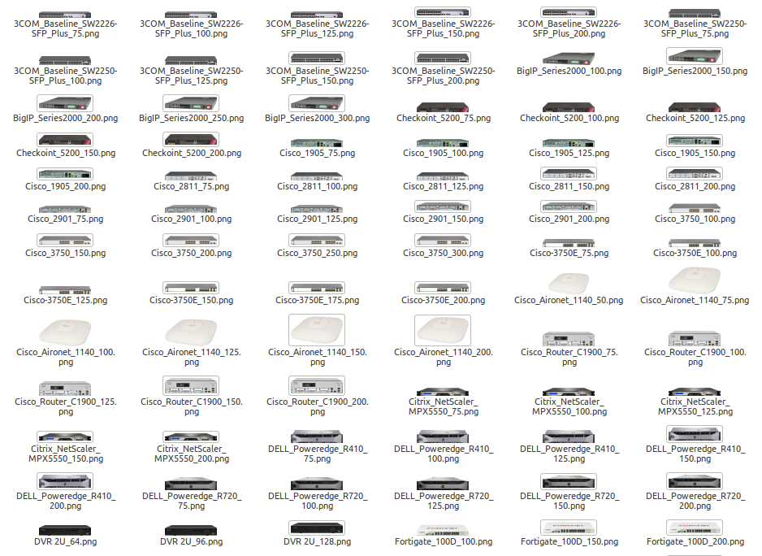
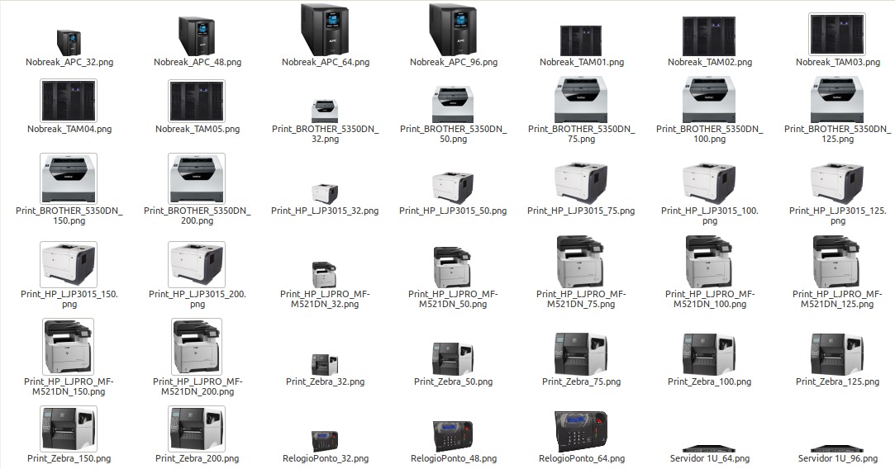
