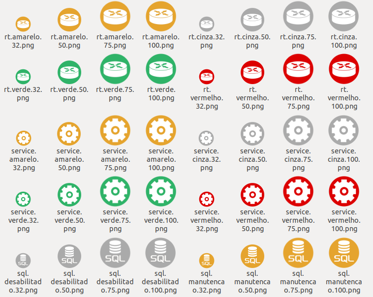

*Leia isto em outros idiomas: [English](README.md), [Português](README.pt.md), [Русский](README.ru.md).*

## Zabbix icones

Autor: Diego Cavalcante\
E-Mail: diego@suportecavalcante.com.br\
Telegram: [diego_cavalcante](https://t.me/diego_cavalcante)\
Descrição: pacote com quase de 3.000 icones para Zabbix Maps

Algumas imagens foram extraidos do Google e outras criadas do zero em diferentes e cores e tamanhos. se você assim como eu dedica ou dedicou um certo tempo no desenvolvimento de mapas, telas e slideshows, meus parabéns pois sei o quando é demorado e muitas vezes complicado expressar de uma forma visual e descomplicada nosso ambiente e infraestrutura, espero que gostem.

OBS: algumas imagens tem livre licença de uso, outras são proprietárias.

## Screenshots

