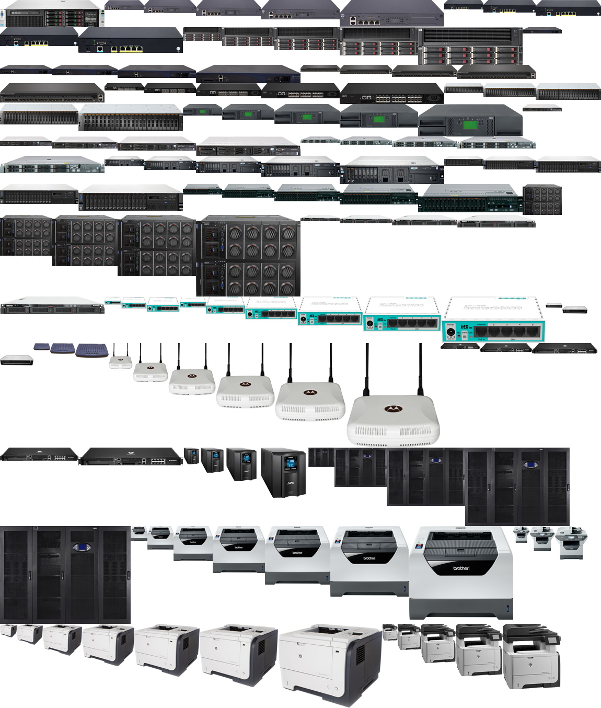
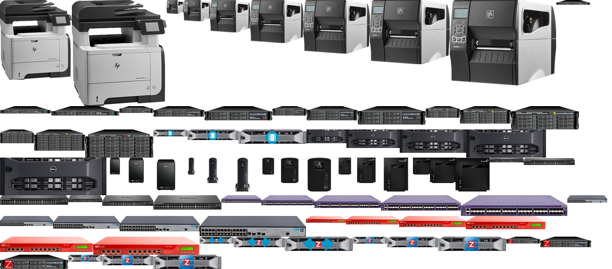
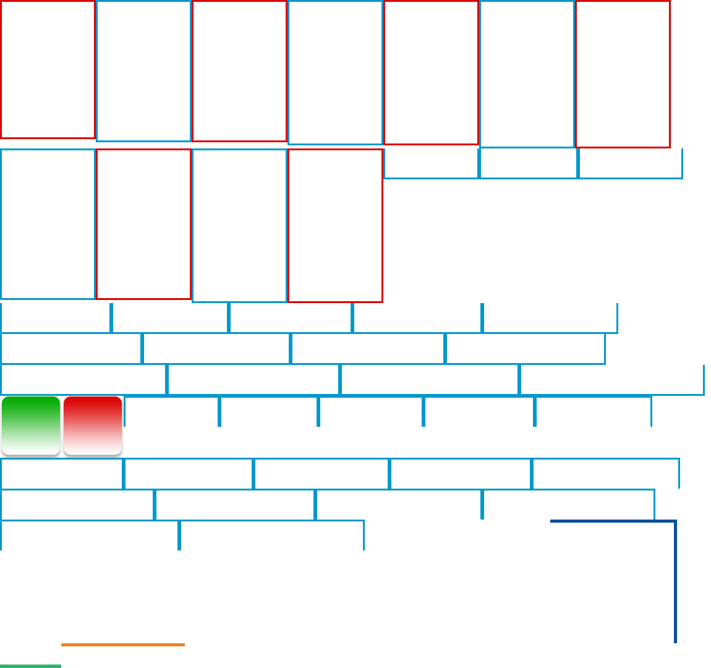
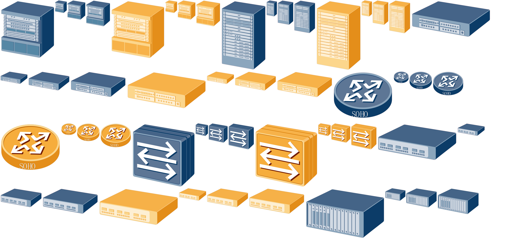
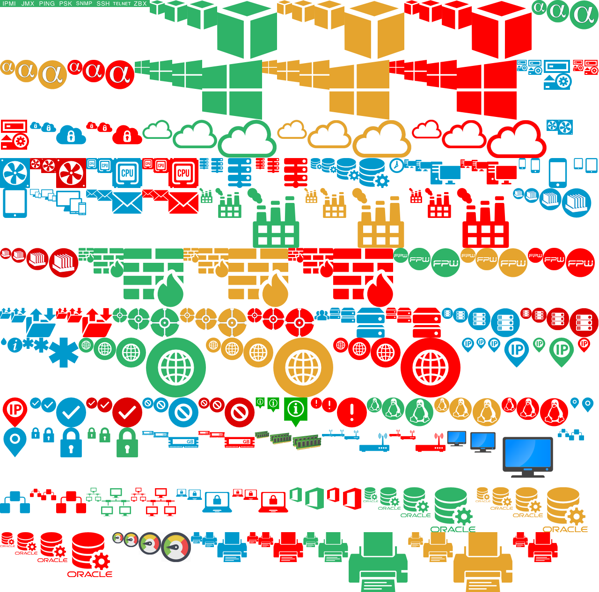
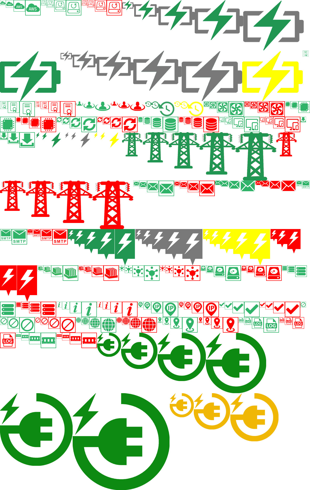
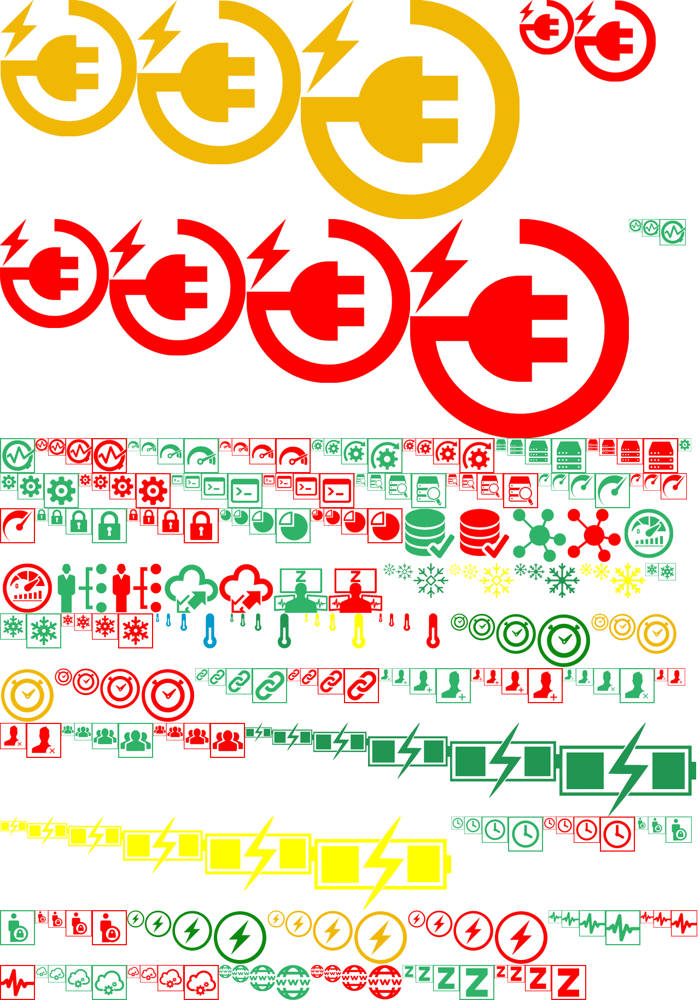
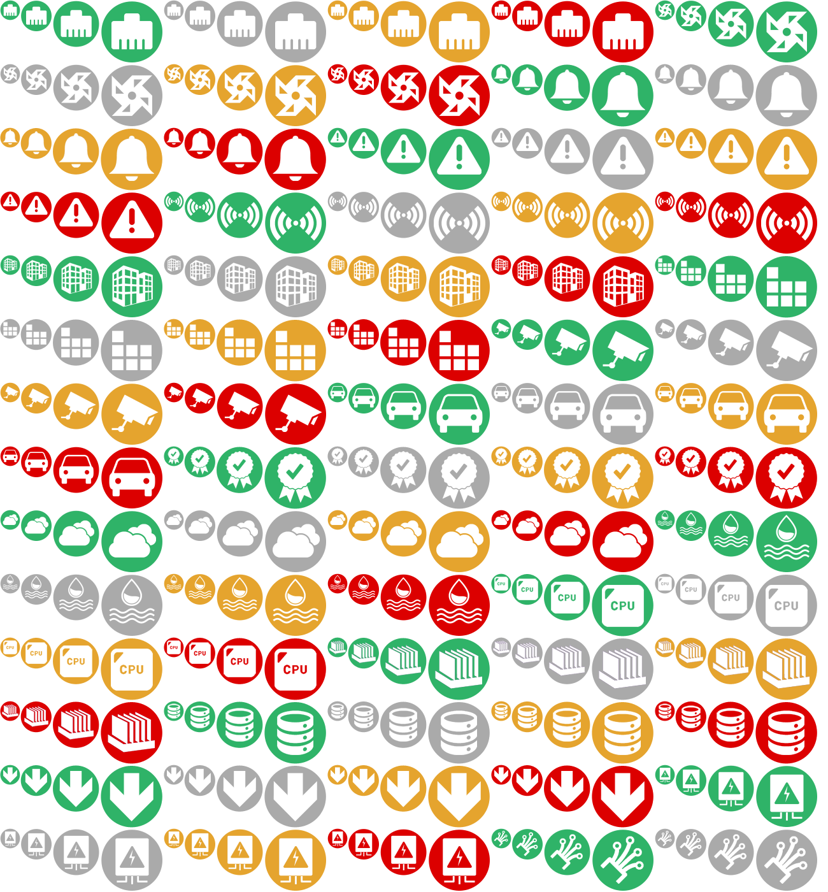
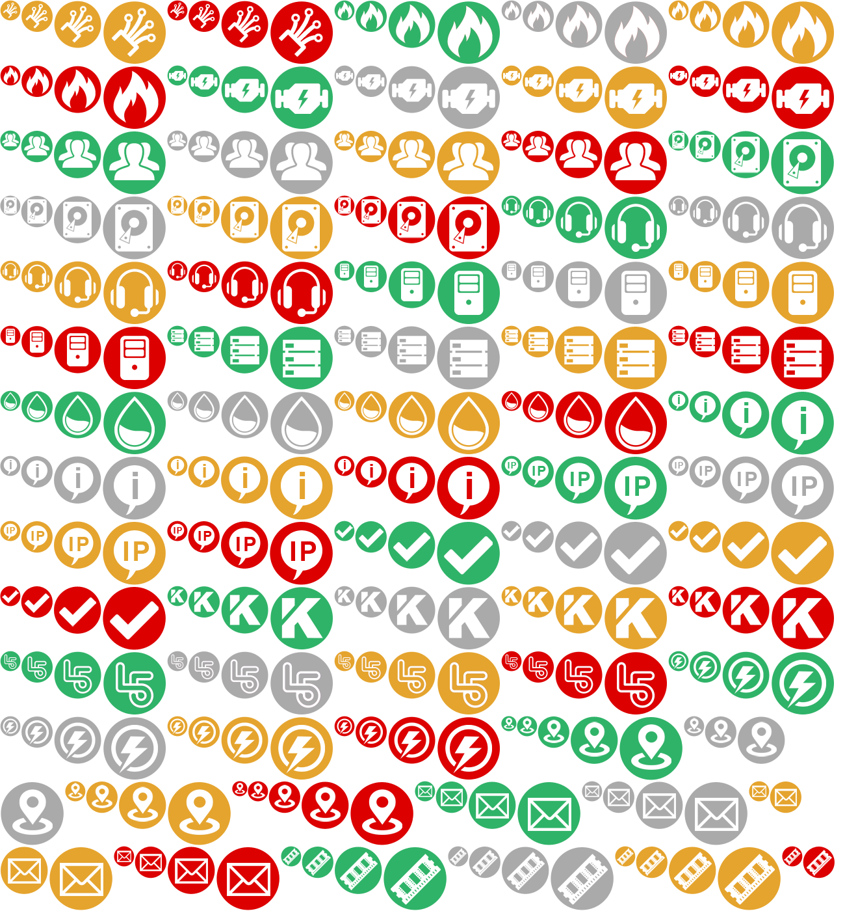
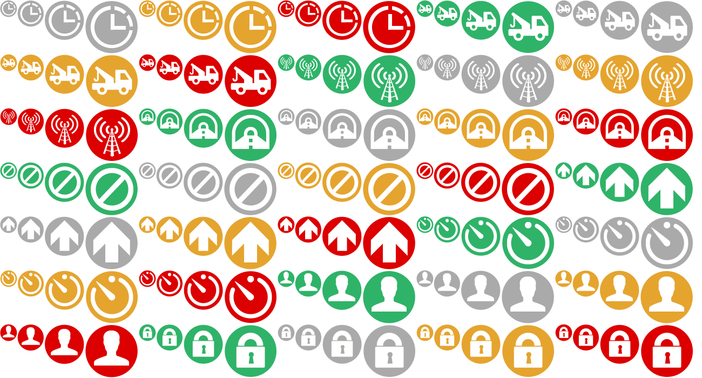

*Прочитать на других языках: [English](README.md), [Português](README.pt.md), [Русский](README.ru.md).*

## Иконки для Zabbix

Автор: Diego Cavalcante\
E-Mail: diego@suportecavalcante.com.br\
Telegram: [diego_cavalcante](https://t.me/diego_cavalcante)\
Описание: набор почти из 3000 иконок для карт Zabbix

Некоторые изображения были взяты из Google, другие созданы с нуля, разных цветов и размеров. Если вы, как и я, потратили некоторое время на поддержание и разработку карт, экранов и слайд-шоу, поздравляю вас, потому что я знаю, что это отнимает много времени и как сложно выразить наше окружение и инфраструктуру визуальным и простым способом, надеюсь, вам понравится.

Примечание: некоторые изображения имеют свободную лицензию, у других есть владельцы, т.е. они являются проприетарными.

## Установка

Всё что вам нужно - импортировать xml файлы в веб-интерфейсе Zabbix:
* Перейдите по адресу *url_вашего_zabbix_сервера/map.import.php*;
* Поставьте галочки напротив Изображения;
* Выберите нужный файл и нажмите Импорт.

Если вы хотите что-то изменить, то нужно сгенерировать собственный набор иконок с помощью скрипта png_to_xml.sh, который перекодирует изображения в текст с помощью base64 и создаёт xml файл из директории с png изображениями.\
Скрипт исправлен, т.к. добавляет лишние теги ```<sysmap></sysmap>```. Исходный файл находится в [архиве]( https://sourceforge.net/projects/zabbix/files/ZABBIX%20Latest%20Stable/4.4.1/zabbix-4.4.1.tar.gz).

Пример использования:
```
cd zabbix.icons.en
./png_to_xml.sh equipment        equipment.xml
./png_to_xml.sh geometry         geometry.xml
./png_to_xml.sh huawei           huawei.xml
./png_to_xml.sh labels           labels.xml
./png_to_xml.sh ../zabbix.icones.pt/legendas ../zabbix.icones.pt/labels.xml
./png_to_xml.sh ../zabbix.icons.ru/labels ../zabbix.icons.ru/labels.xml
./png_to_xml.sh miscellaneous_v1 miscellaneous_v1.xml
./png_to_xml.sh miscellaneous_v2 miscellaneous_v2.xml
./png_to_xml.sh miscellaneous_v3 miscellaneous_v3.xml
./png_to_xml.sh pixel            pixel.xml
./png_to_xml.sh proprietary      proprietary.xml
./png_to_xml.sh rack             rack.xml
./png_to_xml.sh virtualization   virtualization.xml
```

## Скриншоты

Четыре цвета иконки означают четыре состояния: по умолчанию (OK, работает, зелёный), проблема (неисправность, красный), обслуживание (жёлтый), отключено (серый). Для разных иконок имеются разные наборы цветов и размеров.

Примечание: имена файлов и директорий переведены на английский язык, имена исправлены для уменьшения путаницы после импорта в Zabbix.

#### equipment



#### geometry



#### huawei





#### labels


#### miscellaneous_v1


#### miscellaneous_v2


#### miscellaneous_v3




#### proprietary

#### rack

#### virtualization

